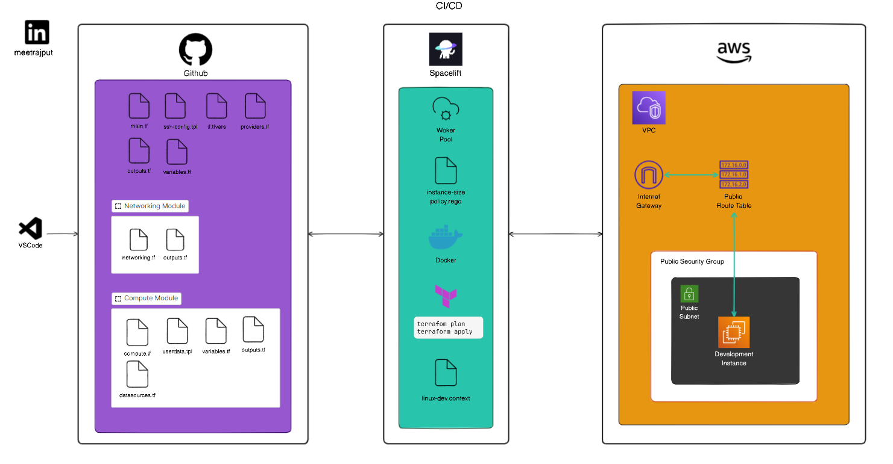

# Building a remote Dev Environment using GitOps

Hi everyone! In this project, we've built a remote Development Environment in AWS using Terraform, Gitops and Spacelift. 

Checkout the diagram below to understand what we we will be working on.

## Tools/Technologies used

- VScode
- WSL2 (optional)
- Github
- AWS CLI
- Spacelift (CI/CD)

*Note:* You can use either Mac, Linux or Windows based on your preference.

## Project Structure

Instead of a monolithic architecture, utilizing Terraform Modules, we can easily create multiple remote development environments based on our needs.

Therefore, we have broken down **main.tf** into two modules: compute and networking. The compute module consists of a keypair and necessary information regarding the instance, while the networking module, as the name suggests, comprises information regarding VPC, Subnet, Internet Gateway, route table, and security group.

we have referenced outputs from both modules in the root module's [main.tf](/terraform-spacelift/main.tf). Using this, we can create as many remote development environments as needed by tweaking a couple of arguments.

After pushing changes to GitHub, we configured the [spacelift](https://spacelift.io/) CI/CD stack for this repository to automatically trigger Terraform initialization, planning, and building processes. Within the CI/CD pipeline, we leverage concepts such as contexts, tasks, and OPA (Open Policy Agent). OPA ensures users can only build instances of the **t2.micro size**.

## Conclusion

In conclusion, our project successfully implemented a modular and scalable remote Development Environment on AWS using Terraform, GitOps, and Spacelift. The adoption of Terraform Modules, modular breakdown of configurations, and seamless integration with Spacelift's CI/CD stack ensure efficient environment creation and maintenance. 

The incorporation of Open Policy Agent (OPA) adds an extra layer of security by restricting users to building instances of a specific size, showcasing a comprehensive and well-orchestrated approach to infrastructure as code.

**Courtesy**

Follow **MoreThanCertified** creator [Derek Morgan](https://www.linkedin.com/in/derekm1215/) for fun courses and insights about DevOps. Checkout the [Repo](https://github.com/morethancertified/tf-spacelift-initial) for the initial project code to build this project.

